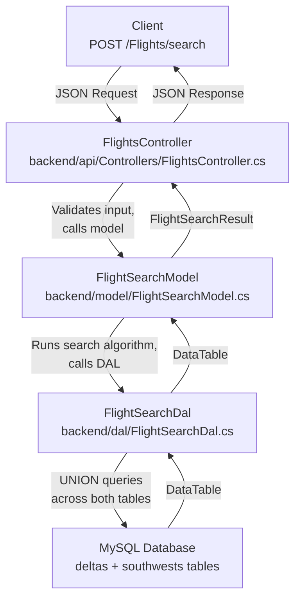
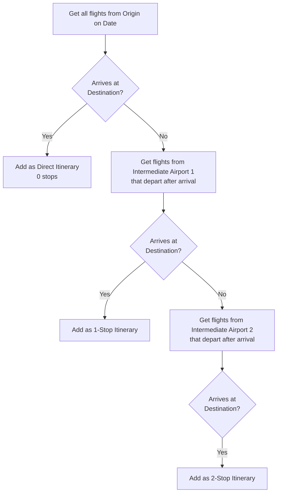

# Flight Search Feature - Backend

## Overview

The Flight Search feature allows customers to search for flights by specifying departure/arrival airports, travel dates, and optional time windows. It supports one-way and round-trip searches and automatically builds itineraries with connecting flights (up to 2 stops).

## Architecture



## What Was Built

### Files Created

| File | Layer | Purpose |
|------|-------|---------|
| `backend/dal/FlightSearchDal.cs` | Data Access | MySQL queries across `deltas` and `southwests` tables using UNION ALL |
| `backend/model/FlightSearchTypes.cs` | Model | Domain types: `FlightSegment`, `Itinerary`, `FlightSearchResult` |
| `backend/model/FlightSearchModel.cs` | Model | Search algorithm with connecting flight logic |
| `backend/api/FlightSearchRequest.cs` | API | Request DTO for the search endpoint |

### Files Modified

| File | Change |
|------|--------|
| `backend/api/Controllers/FlightsController.cs` | Added `POST /Flights/search` endpoint with input validation |

### Connecting Flight Algorithm

The search algorithm finds direct and connecting itineraries using a BFS approach:



**Key rules:**
- Maximum 2 stops (3 flight segments) per itinerary
- Connecting flights must depart after the previous flight arrives
- Departure time window applies to the first segment only
- Arrival time window applies to the last segment only
- Results are sorted by shortest total duration, then fewest stops
- Round-trips run the algorithm twice, swapping origin and destination

## API Endpoint

### `POST /Flights/search`

**Request Body:**

```json
{
  "departureAirport": "ATL",
  "arrivalAirport": "DEN",
  "departureDate": "2023-01-03",
  "returnDate": "2023-01-05",
  "departureTimeStart": "08:00",
  "departureTimeEnd": "18:00",
  "arrivalTimeStart": "10:00",
  "arrivalTimeEnd": "23:00"
}
```

| Field | Required | Description |
|-------|----------|-------------|
| `departureAirport` | Yes | IATA code (e.g. `"ATL"`) or full format (e.g. `"Atlanta (ATL)"`) |
| `arrivalAirport` | Yes | IATA code or full format |
| `departureDate` | Yes | Travel date (format: `YYYY-MM-DD`) |
| `returnDate` | No | Return date for round-trip. Omit for one-way |
| `departureTimeStart` | No | Earliest departure time (format: `HH:mm`) |
| `departureTimeEnd` | No | Latest departure time |
| `arrivalTimeStart` | No | Earliest arrival time |
| `arrivalTimeEnd` | No | Latest arrival time |

**Response:**

```json
{
  "outboundItineraries": [
    {
      "segments": [
        {
          "id": 9,
          "flightNumber": "DL343",
          "airline": "Delta",
          "departAirport": "Atlanta (ATL)",
          "arriveAirport": "Cleveland (CLE)",
          "departDateTime": "2023-01-03T00:59:00",
          "arriveDateTime": "2023-01-03T02:44:00"
        },
        {
          "id": 1234,
          "flightNumber": "WN500",
          "airline": "Southwest",
          "departAirport": "Cleveland (CLE)",
          "arriveAirport": "Denver (DEN)",
          "departDateTime": "2023-01-03T05:30:00",
          "arriveDateTime": "2023-01-03T07:45:00"
        }
      ],
      "stops": 1,
      "totalDurationMinutes": 406
    }
  ],
  "returnItineraries": []
}
```

**Validation errors return `400 Bad Request`:**
- `DepartureAirport` and `ArrivalAirport` are required and must be different
- `DepartureDate` is required
- `ReturnDate` must be on or after `DepartureDate`
- Time window start must be before end

## How to Test

### 1. Start the MySQL Database

```bash
docker compose -f .devcontainer/docker-compose.yml up db -d
```

Wait for MySQL to be healthy, then import the flight data:

```bash
mysql -h 127.0.0.1 -P 3333 -u root -prootpassword flightdata < flightdata_deltas-1.sql
mysql -h 127.0.0.1 -P 3333 -u root -prootpassword flightdata < flightdata_southwests.sql
```

> You only need to do this **once**. The data persists in the Docker volume after the first import.

### 2. Run the API

```bash
cd backend/api
dotnet run
```

The API starts at `http://localhost:5237`.

### 3. Test the Endpoints

#### Browser URLs (GET requests -- paste directly in browser)

**Get random flights:**

```
http://localhost:5237/Flights/getNextFlights?count=2
```

**Get 10 random flights (default):**

```
http://localhost:5237/Flights/getNextFlights
```

**OpenAPI spec:**

```
http://localhost:5237/openapi/v1.json
```

#### Search Endpoint (POST requests -- use curl, Postman, or api.http)

The search endpoint is `POST`, so it can't be tested from the browser URL bar. Use one of the methods below.

**One-way search** -- ATL to DEN on Jan 3, 2023:

```bash
curl -X POST http://localhost:5237/Flights/search \
  -H "Content-Type: application/json" \
  -d '{"departureAirport": "ATL", "arrivalAirport": "DEN", "departureDate": "2023-01-03"}'
```

**Round-trip with time windows** -- ATL to DEN, departing Jan 3, returning Jan 5, departures between 8am-6pm:

```bash
curl -X POST http://localhost:5237/Flights/search \
  -H "Content-Type: application/json" \
  -d '{"departureAirport": "ATL", "arrivalAirport": "DEN", "departureDate": "2023-01-03", "returnDate": "2023-01-05", "departureTimeStart": "08:00", "departureTimeEnd": "18:00"}'
```

**One-way with arrival time window** -- MCO to LAX on Jan 3, arriving before 8pm:

```bash
curl -X POST http://localhost:5237/Flights/search \
  -H "Content-Type: application/json" \
  -d '{"departureAirport": "MCO", "arrivalAirport": "LAX", "departureDate": "2023-01-03", "arrivalTimeEnd": "20:00"}'
```

**Using full airport name format:**

```bash
curl -X POST http://localhost:5237/Flights/search \
  -H "Content-Type: application/json" \
  -d '{"departureAirport": "Atlanta (ATL)", "arrivalAirport": "Denver (DEN)", "departureDate": "2023-01-03"}'
```

### Data Notes

- Flight data covers late December 2022 to early January 2023
- `deltas` table: ~15,000 Delta flights
- `southwests` table: ~30,000 Southwest flights
- Airports are stored as `"City (IATA)"` format (e.g. `"Atlanta (ATL)"`, `"Denver (DEN)"`)
- The search accepts either IATA codes or the full format as input
