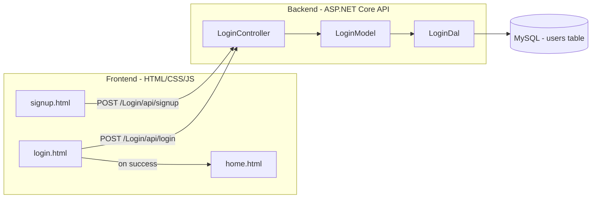

# WPI Airline — Frontend

A clean, responsive frontend for the WPI Airline login and signup system. Built with plain HTML, CSS, and JavaScript — no frameworks required.

## Architecture



## Pages

| File            | Description                                                                 |
| --------------- | --------------------------------------------------------------------------- |
| `login.html`    | Login form that authenticates against the backend API                       |
| `signup.html`   | Registration form with password confirmation and duplicate username handling |
| `home.html`     | Landing page shown after a successful login (Flight Home Page)              |
| `style.css`     | Shared stylesheet — centered card layout, gradient background, form styles  |
| `app.js`        | Shared JavaScript — API calls (`login`, `signup`), form handlers, redirects |

## Prerequisites

- The **backend API** must be running on `http://localhost:5237`. To start it:

```bash
cd backend/api
dotnet run
```

- A **MySQL database** with a `users` table must be accessible by the backend (see backend configuration for connection details).

## How to View

1. Make sure the backend API is running (see above).
2. Open the login page in your browser using one of these methods:

   **Option A** — Run from the project root:
   ```bash
   open frontend/login.html
   ```

   **Option B** — Paste the full file path in your browser:
   ```
   file:///Users/ramafaris/Documents/GitHub/FrontendProject/frontend/login.html
   ```

   **Option C** — If you have the **Live Server** VS Code extension, right-click `login.html` in the explorer and choose "Open with Live Server".

3. From the login page you can:
   - Click **Sign up** to create a new account
   - Log in with an existing account to reach the **Flight Home Page**

## How It Works

1. The user fills in the login or signup form.
2. `app.js` sends a `POST` request with JSON (`{ username, password }`) to the backend API.
3. The backend validates credentials (login) or inserts a new user (signup) via MySQL.
4. On successful login, the username is stored in `sessionStorage` and the user is redirected to `home.html`.
5. On successful signup, the user is redirected to the login page.
6. The home page reads the username from `sessionStorage` and displays a welcome message. If no session exists, it redirects back to login.
